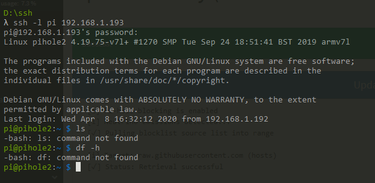

# SSH -bash somecommand: command not found

After setting up RaspberryPi and enabling SSH, I would get command not found 
while trying to do simple commands such as ls.

Fix: Add `export PATH=/usr/bin:/bin:/usr/sbin:/sbin:/usr/local/bin:/usr/X11/b‌​in` 

